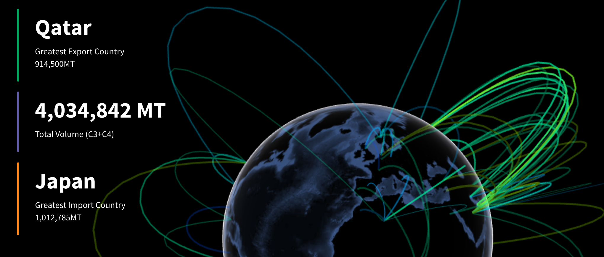
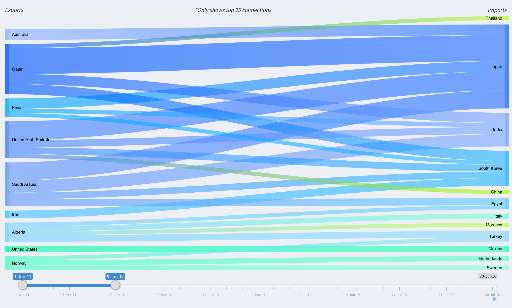
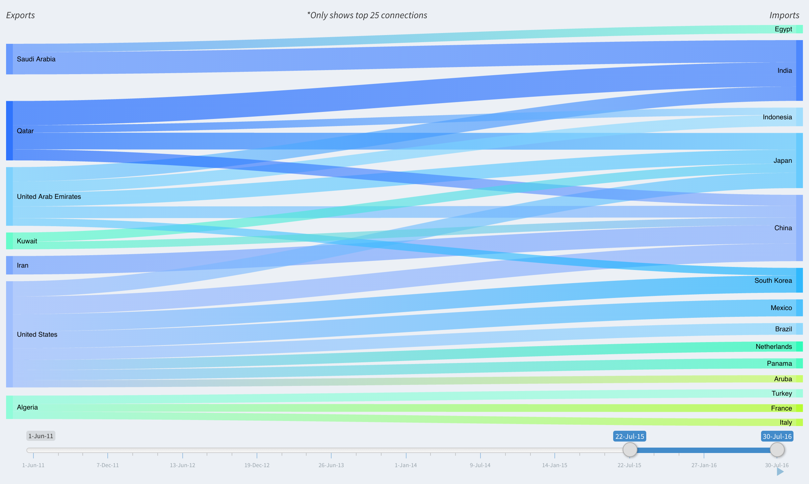

# Global LPG Trade Dashboard

**_App:_ [Beta Shiny Application](https://sjstebbins.shinyapps.io/ShinyApp/)
_NYCDSA Blog Post:_ [NYC Data Science Academy Blog Post](http://blog.nycdatascience.com/student-works/tracking-global-lpg-trade/ ) **


#### Developed for shiny application project while attending NYC Data Science Academy

[](./images/globe.png)

## Purpose

95% of the world's goods are transported via the ocean including a variety of cargo and essential energy resources. Liquid petroleum gas, commonly known as LPG or referred to as propane, is just one of these energy resources. LPG is mixture of flammable gases often used for heating, cooling appliances and cars in developing countries who lack the energy infrastructure for more common types of fuel. As these developing countries grow, the volume of LPG transported has followed to meet these developing countries increasing energy demands. The volume of LPG transported worldwide has increased drastically over the past 3 years and the order book for new vessels will account for 35% of all vessels on the water when completed by 2019. These trends substantiate the importance of this growing commodity type and this application was develop to better map global LPG transportation at a country and vessel level in order to assess the transformative patterns that have occurred over the past few years and dramatically visualize this data which has existed mainly in only private excel sheets. Furthermore, this project lays the foundation for a dashboard that could not only visualizes historical data as it does in its current state, but could merge this import/export data with automated production and ship position data to predict future over and undersupply of LPG in various regions (see next steps section for more) and give ship owners an edge positioning their open vessels in this increasingly competitive market.

## Observations

Probably the most noticeable trend in the last five years in global LPG transportation is the the dramatic change in which countries export the most LPG. The Far East region including primarily China, Japan, South Korea, and India have remained consistent as the largest importers of LPG year after year with an increase in Indian imports and a decrease in Japanese imports over the last few years. Although the volume of imported LPG has increased among these countries, the countries have remained fairly consistent. The same however cannot be said about countries which export LPG. Over the last five years, the greatest export countries of LPG have shifted dramatically. Five years ago, countries within the Arabian gulf region including Qatar, UAE, and Saudi Arabia dominated the global exports, while now the U.S. has become the single largest exporter of LPG (up from nearly zero exports in 2011). For those in the industry, this trend is common knowledge, but again this known trend has probably not been visualized in such a dramatic mapped fashion or through  flow charts that adjust dynamically over time.
[](./images/flow1.png) [](./images/flow2.png)

## Next Steps

The real power of this application exists not in its current state, as a visualization dashboard, but through the potential it has if  further data sets are compared against this preexisting data. If I were to get access to APIs that automatically feed in the real time data for the pre-existing data sources, the current positions of all global VLGCs with their ballast or laden (empty or full) statuses worldwide, and LPG  inventory and production data at a country level, it would not be very difficult to assess present and future over or under supply of LPG globally. Comparing these data resources against the flow data the application already presents would allow a user to assess the number of VLGCs in each region or country compared to the inventories and production levels for that country both historically and forward looking. Predicting future over or under supply of VLGC and inventories has amazing potential because ship owners could then make more accurate speculations on where to send their open vessels.  

* * *

## Technical Development

#### Data Manipulation

When starting this project, I knew I wanted to plot LPG trade data from IHS Connect (_see Data section_) which has lifting information indicating the volume traded as well as the source and destination countries of every voyage where a vessel was carrying LPG.  This was a great start, but the first hurdle was how to obtain coordinate data for countries in order to then plot the arcs between countries you see on the map tab. To do this, I merged this lifting data with the Google countries dataset (_see Data section_)  both on the source country and the destination country columns to assign a latitudinal and longitudinal center for each country.

```r
#set source and destination country latitude and longitudes
ihs <- read.csv("https://raw.githubusercontent.com/sjstebbins/ShinyApp/master/Data/ihs.csv")
countries <- read.delim("https://raw.githubusercontent.com/sjstebbins/ShinyApp/master/Data/countries.csv")
#join tables with new source and destination lat and longs
ihs <- left_join(ihs, select(countries,Country,Latitude,Longitude), by=c('Source..1.' ='Country')) %>% rename(Source.Country.Lat=Latitude, Source.Country.Long=Longitude)
ihs <- left_join(ihs, select(countries,Country,Latitude,Longitude), by=c('Primary.Destination.Country' ='Country')) %>% rename(Destination.Country.Lat=Latitude, Destination.Country.Long=Longitude)
```

#### Reactive Filtering

With this accomplished, I then created a reactive function to filter this lifting data based on user input from the date slider. This was done using observeEvents to update reactiveValues that could then be accessed within other reactive elements in the server.R file. The filterData reactive function filters the reactiveValue for data `values$data` based on the country dropdown selectors `input$filter`,which then updates the map, flow chart, and data table reactive components. However, because this filterData function doesn't change the reactiveValue, `values$data`, the list of all countries still within that date range is still accessible and can be used as the selection options in the dropdown country selector `output$filter`.

```r
values <- reactiveValues(theme = system.file("images/world.jpg", package="threejs"), lat = 0, long = 0, data = NULL, nodest= NULL)
#main slider filter
observeEvent(input$slider, {
  #filter out NA destinations
  data <- ihs[!is.na(ihs$Destination.Country.Lat) & !is.na(ihs$Source.Country.Lat),]
  #filter out all routes where destination is same as source
  data <- data[data$Source..1\. != data$Primary.Destination.Country,]
  #filter data based on date slider
  values$data <- data[data$Date >= input$slider[1] & data$Date <= input$slider[2],]
})
#main filter function
filterData <- reactive({
  if(!is.null(input$filter)) {
    return(values$data[values$data[,input$radio] %in% input$filter,]) }
  else {
    return(values$data)
  }
})
#render unique country selections based on the radio button input
output$filter <- renderUI({
  if (input$radio == 'Source..1.') {
    label <- 'Source:'
  } else {
    label <- 'Destination:'
  }
  columns <- unique(values$data[ ,input$radio]) selectInput("filter", paste(label, sep=''), c("All" = "", columns), selectize=TRUE, multiple=TRUE)
})
```

#### Threejs Globe

The most interesting part of developing this application from a technical standpoint was probably the implementation of the threejs package for R within a shiny dashboard application. The threejs package for R exposes a few threejs widgets including the globejs module which I used to create the main component for map tab of the application. Although threejs is a powerful javascript-based, graphics framework, this package really limits the amount of customization allowed on the exposed components. Given these limitations, I used the filterData function to update the arcs positioning, thickness, and colors based on adjustments to the reactive date slider.

```r
# set data to be render in arcs
flow <- reactive({      
  return (
    select(filterData(),Source.Country.Lat,Source.Country.Long,Destination.Country.Lat,Destination.Country.Long)
  )
})
# arc thickness based on volume
volume <- reactive({
  return((filterData()$volume / max(filterData()$volume, na.rm=TRUE)) * 4)
})
# set globe
output$globe <- renderGlobe(
  globejs(
    img=values$theme,
    arcs=flow(),
    arcsHeight=.9,
    arcsLwd=volume(),
    arcsColor=filterData()$color, #extract color column from filtered data arcsOpacity=0.25,
    pointsize=0.5,
    rotationlat=values$lat,
    rotationlong=values$long,
    fov=50,
    atmosphere=TRUE
  )
)
```

#### Custom Styling

The rigidity of the adjusting Javascript and CSS from within a shiny R application was probably the most substantial hurdle I faced when developing this application. Although I was able to add script tags to the dashboard body to set up jQuery event handling, adjusting the threejs package from within the server.R was less successful given the time constraints of this project. Writing custom CSS was accomplished by injected a style tag at the top of the dashboard body component of the UI.R file like so:

```r
dashboardBody(
  #custom css styling
  tags$head(
    tags$style(
      HTML('
        .main-sidebar {
          padding-top: 0px !important
        }
      ')
    )
  )
)
```

For more information, read the inline comments within the files of the github repo

 **View Github: [Github](https://github.com/sjstebbins/ShinyApp)** Written in R, using R studio. Deployed using ShinyIO. Packages used:

*   shiny
*   shinydashboard
*   DT
*   threejs
*   rgdal
*   dplyr
*   googleVis

* * *

## Data

*   [IHS Connect Waterborne Historical LPG Liftings ](https://connect.ihs.com/)
*   [Google Countries Dataset](https://developers.google.com/public-data/docs/canonical/countries_csv)
